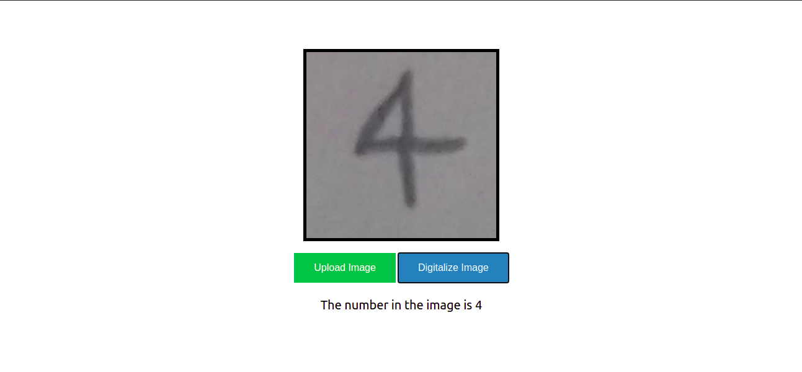
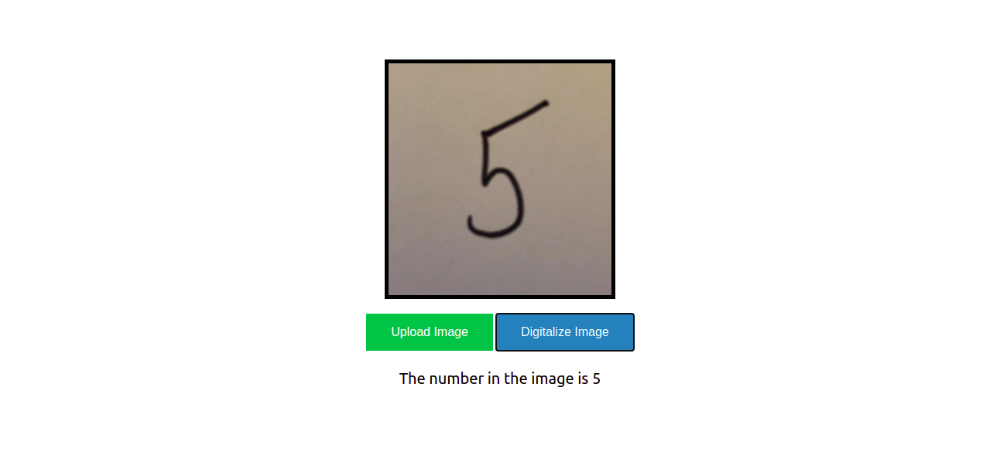

# Handwritting numbers



## Description :book:
Convert a number printed on an image in a int32 number

## Installation :floppy_disk:

In Ubuntu:

0. go inside the Handwritting_numbers folder

```console
foo@bar:~$ cd /Handwritting_numbers
```

1. install Docker and Docker compose, if you have not installed yet

```console
foo@bar:~/Handwritting_numbers$ chmod u+x installDockerCompose && ./installDockerCompose
```

2. execute the docker-compose up

```console
foo@bar:~/Handwritting_numbers$ docker-compose up
```

## Usage :open_file_folder:

0. Click on "Upload Image" and choose an image from you device.


1. Click on "Digitalize Image" to know what is the number representation of the image




## Support :email:

LinkedIn:

- [Arturo Victoria Rincon](https://www.linkedin.com/in/arturovictoriar/)

Twitter:

- [Arturo Victoria Rincon](https://twitter.com/arturovictoriar)

Portfolio website:

- [Arturo Victoria Rincon](http://arturovictoriar.github.io/)

## Authors and acknowledgment :school:

Arturo Victoria Rincon is Mechatronics Engineer with innate leadership and adaptability skills. Focused on developing software to improve people's quality of life using tools such as Python, Javascript, C, and C ++.

## License :warning:

:copyright: 2021 All rights reserved.

## Project status :white_check_mark:

It needs be tested on the API, UI and ML predict. The service only works with one digit number.

## Author :black_nib:

* **Arturo Victoria Rincon** [@arturovictoriar](https://github.com/arturovictoriar)
